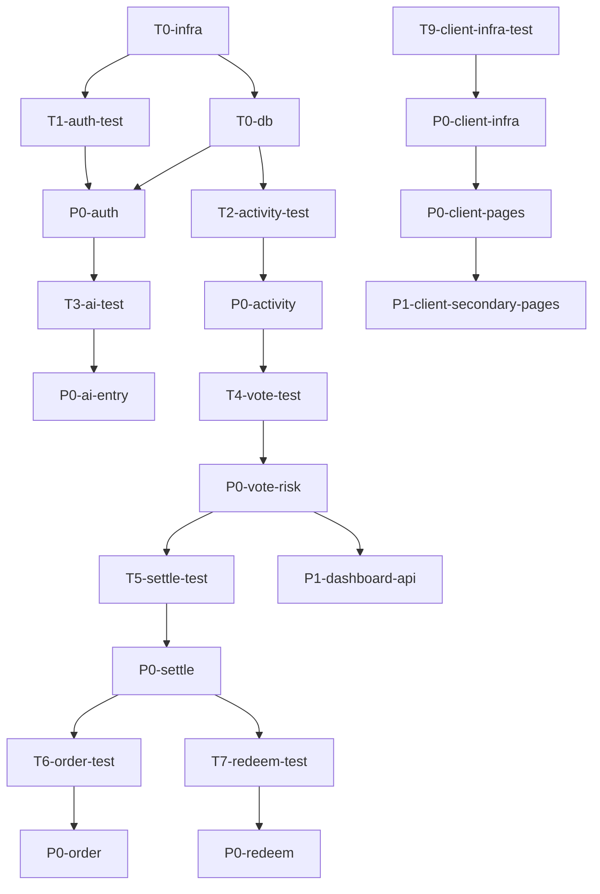

# Free Cake MVP - 开发任务清单

## 概述
- **技术方案来源**: docs/tasks/free-cake-mvp/tech-solution.yaml
- **范围**: P0（核心业务闭环）+ P1（辅助功能）
- **测试覆盖目标**: 80%
- **每功能最少测试**: 3 个用例
- **测试优先**: 每个 P0 code 任务前必有 test 任务

## 任务依赖关系图

## P0 任务（必须完成）

| ID | 类型 | 标题 | 依赖 |
|----|------|------|------|
| T0-infra | infra | 初始化 Rust 后端项目骨架 | - |
| T0-db | infra | 初始化数据库层与迁移 | T0-infra |
| T1-auth-test | test | 认证模块单元测试 | T0-infra |
| P0-auth | code | 实现认证接口 | T1-auth-test |
| T2-activity-test | test | 活动管理模块测试 | T0-db |
| P0-activity | code | 实现活动管理接口 | T2-activity-test |
| T3-ai-test | test | AI 生成与参赛模块测试 | T0-db, P0-auth |
| P0-ai-entry | code | 实现 AI 生成与参赛接口 | T3-ai-test |
| T4-vote-test | test | 投票与风控模块测试 | T0-db, P0-activity |
| P0-vote-risk | code | 实现投票与风控接口 | T4-vote-test |
| T5-settle-test | test | 开奖结算模块测试 | P0-vote-risk |
| P0-settle | code | 实现开奖结算接口 | T5-settle-test |
| T6-order-test | test | 订单与排产模块测试 | P0-settle |
| P0-order | code | 实现订单与排产接口 | T6-order-test |
| T7-redeem-test | test | 核销模块测试 | P0-settle |
| P0-redeem | code | 实现核销接口 | T7-redeem-test |
| T9-client-infra-test | test | 前端项目初始化测试 | - |
| P0-client-infra | code | 初始化前端 refine 项目 | T9-client-infra-test |
| P0-client-pages | code | 实现 B 端核心页面 | P0-client-infra |

## P1 任务（优先完成）

| ID | 类型 | 标题 | 依赖 |
|----|------|------|------|
| T8-inventory-test | test | 库存与门店模块测试 | T0-db |
| P1-inventory-store | code | 实现库存与门店接口 | T8-inventory-test |
| P1-audit-notification | code | 审计日志与通知服务 | T0-infra |
| P1-dashboard-api | code | Dashboard 统计接口 | T0-db, P0-vote-risk, P0-settle |
| P1-client-secondary-pages | code | B 端辅助页面与组件 | P0-client-pages |

## 测试命令
- 后端: `cd server && cargo test`
- 前端: `cd client && npx jest`
- 全量: `cd server && cargo test && cd client && npx jest`

## Lint 命令
- 后端: `cd server && cargo clippy`
- 前端: `cd client && npx eslint src/ --fix`
