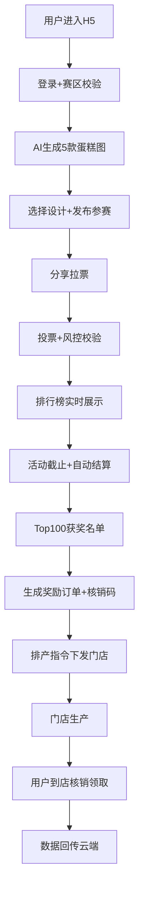
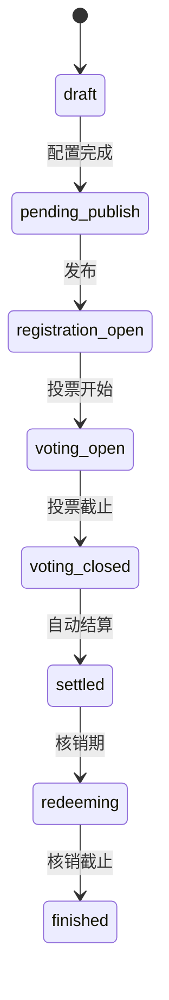

# Free Cake MVP 技术方案

## 一、背景与目标

Free Cake 是面向村镇下沉市场的 AI 蛋糕活动与履约平台。核心逻辑：免费蛋糕活动获客 → 到店核销自提 → 未获奖转付费 + 私域复购实现盈利。

MVP 目标：验证「村镇免费蛋糕活动 + 到店履约 + 付费转化」模型是否成立。

## 二、范围

### 做什么（MVP）
- C 端 H5 参赛页：登录/赛区校验/AI 出图/参赛/投票/排行/领奖
- B 端运营后台（refine）：活动/赛区/风控/排产/核销/库存/门店/报表
- 后端 Rust Axum API 服务
- MySQL + Redis 数据层

### 不做什么（MVP）
- 微信小程序（MVP 仅 H5）
- ROS2 设备自动生产（首期人工确认开关）
- 人员考勤与薪资核算
- 多赛区管理（首期单赛区）
- 自动排产（首期人工排产）

## 三、核心设计思路

### 架构：模块化单体
- 前端：refine + react + vite + Ant Design（B 端管理后台）
- 后端：Rust Axum（模块化单体，按 handler/service/db 分层）
- 数据：MySQL（事务数据）+ Redis（缓存/限流/排行榜）
- 对象存储：OSS/COS（AI 生成图/活动素材）

### 关键设计决策
1. **Rust 后端**：高性能、低资源占用、适合村镇低成本部署，Axum 模块化单体避免首期微服务过度设计
2. **refine 前端**：refine 是 React 管理后台框架，内置 CRUD/认证/路由，B 端后台场景最适合
3. **活动状态机**：draft → pending_publish → registration_open → voting_open → voting_closed → settled → redeeming → finished
4. **投票风控**：多维度联合判定（手机号/OpenID/设备指纹/IP/定位），异常票先冻结后复核
5. **核销幂等**：一单一码，有效期控制，Redis 分布式锁防重复核销

## 四、方案流程图

## 五、关键状态机

### 活动状态机

### 核销码状态
- generated → valid → used（成功核销）
- generated → expired（超过有效期）
- generated → cancelled（手动取消）

## 六、AC → 文件映射确认

| AC 编号 | AC 描述 | ac_type | 对应文件路径 | 实现方式 |
|---------|---------|---------|-------------|---------|
| AC-01 | AI 出图与参赛 | code | server/src/handlers/entry.rs + server/src/services/ai_generator.rs + client/src/pages/activities/create.tsx | 新增 |
| AC-02 | 投票与风控 | code | server/src/handlers/vote.rs + server/src/services/risk_control.rs + server/src/services/rank_cache.rs | 新增 |
| AC-03 | 自动结算 | code | server/src/handlers/settlement.rs | 新增 |
| AC-04 | 核销领取 | code | server/src/handlers/redeem.rs | 新增 |
| AC-05 | 活动管理 | code | server/src/handlers/activity.rs + client/src/pages/activities/ | 新增 |
| AC-06 | 风控审核 | code | server/src/services/risk_control.rs + client/src/pages/votes/risk-control.tsx | 新增 |

## 七、技术栈确认

| 层 | 技术 | 说明 |
|----|------|------|
| 前端 B 端 | refine + react + vite + Ant Design | refine 管理后台框架 |
| 后端 | Rust Axum | 模块化单体 |
| 数据库 | MySQL 8.x | 事务数据 |
| 缓存 | Redis 7.x | 限流/排行榜/幂等 |
| 对象存储 | OSS/COS | 图片素材 |
| AI 能力 | 文生图 API | 第三方对接 |

## 八、风险与验证策略

| 风险 | 等级 | 缓解 |
|------|------|------|
| 刷票公信力崩盘 | P0 | 多维度风控 + 异常票冻结 + 人工复核 |
| AI 图不可生产 | P1 | 模板映射 + 装饰参数限制 |
| 网络不稳定 | P1 | 核销端离线缓存 + 补传 |
| 排行榜缓存不一致 | P1 | 3-10s 刷新 + 流水与排行榜分离 |
| 食品安全合规 | P1 | 原料批次追踪 + 过期禁用 + SOP |

### 回滚策略
- Feature flag 控制：异常时关闭自动结算/风控，回退人工模式
- 核销幂等：重复操作不产生副作用
- 开奖重试：失败可人工补偿重试

## 九、待确认项

1. AI 文生图 API 具体选择哪家（Stable Diffusion / MidJourney / 国内模型）
2. OSS/COS 具体云厂商选择
3. 门店核销端是否需要独立小程序还是复用 H5
4. MVP 首镇试点具体选址
